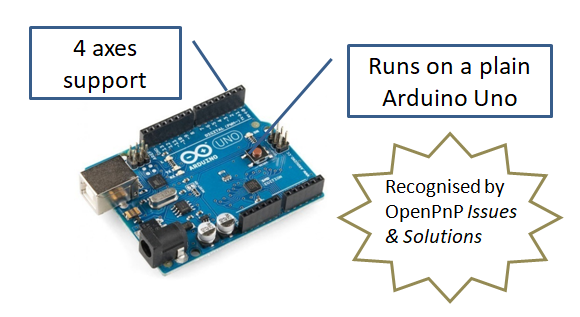
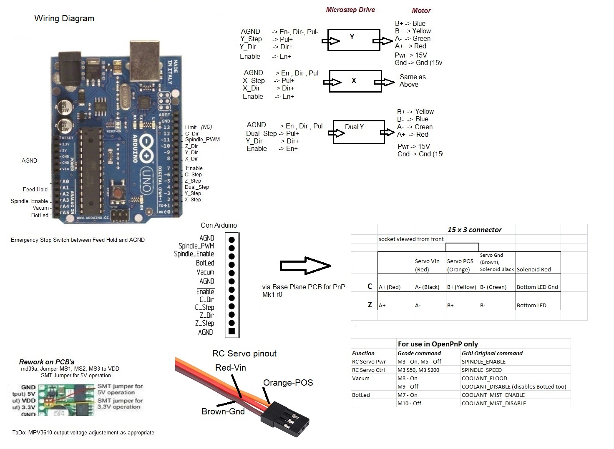

## Grbl Firmware for OpenPnP

### Features
 - Dual Y axis
 - PWM output to control an Remote Control (RC) Servo for Drag Feeder
 - Support for two actuators
 - Forked from GRBL_VERSION "1.1h" GRBL_VERSION_BUILD "20190830"

### A Machine in Action
https://user-images.githubusercontent.com/26599790/154530634-a4084f31-4077-454d-b018-5f61cd336622.mp4

### Recommended  Wiring Diagram

### Repurposed GCodes
Function | Command
----|-----
RC Servo Power  | M3 - On, M5 - Off
RC Servo Position | S30 - raise, S90 - lower
Vacuum  | M8 - On, M9 - Off
LED | M7 - On, M10 - Off

### GCode Driver Commands
OpenPnP *Issues and Solutions* recognises this firmware and auto populates GCode commands. The following is only for reference.

Setting | GCode
----|-----
CONNECT_COMMAND | G21 ; Set millimeters mode   G90 ; Set absolute positioning mode
HOME_COMMAND | $H; 
MOVE_TO_COMMAND | G1 {X:X%.4f} {Y:Y%.4f} {Z:Z%.4f} {C:C%.4f} {FeedRate:F:%.2f}
MOVE_TO_COMPLETE_COMMAND |G4 P0; Wait for moves to complete before returning
SET_GLOBAL_OFFSETS_COMMAND | G92 {X:X%.4f} {Y:Y%.4f} {Z:Z%.4f} {C:C%.4f} ; reset coordinates_
COMMAND_CONFIRM_REGEX | ^ok.*
POSITION_REPORT_REGEX | ^.\*(?<X>-?\d+\.\d+) (?<Y>-?\d+\.\d+) (?<Z>-?\d+\.\d+) (?<C>-?\d+\.\d+).*
COMMAND_ERROR_REGEX  | ^Crash.*

#### Credits

Grbl is an open-source project fueled by the free-time of our intrepid administrators and altruistic users. If you'd like to donate, all proceeds will be used to help fund supporting hardware and testing equipment. Thank you!

A fourth axis for grbl was added by Bob Beattie in 2014

It was updated to version 1.1h and made I&S compatible by Ravi Ganesh in 2021

